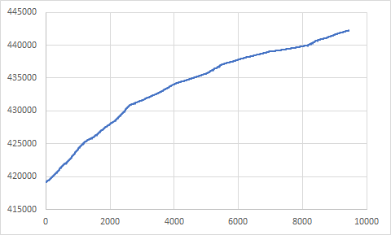

در شبکه های اجتماعی ویدیویی را دیدم که نشان میداد صفحه پتیشن برای کارزار #من_وکالت_میدهم نوسان های سوال برانگیزی دارد. این برنامه ساده هر یک دقیقه تعداد رای ها را ثبت میکند که بعد به سادگی میتوان نمودار پراکندگی آن را در گذر زمان کشید.
همانطور که مشاهده میشود در بعضی نقطه ها رای ها پایین میرود ولی به صورت کلی سیر نزولی است.

# نمودار پراکندگی (Scatter Plot)

